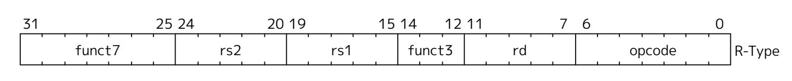
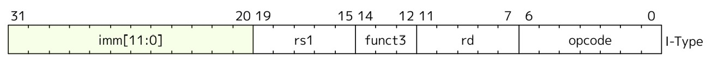
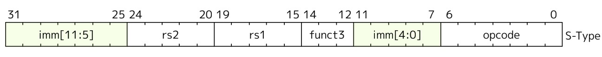
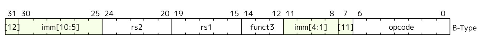
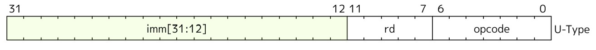
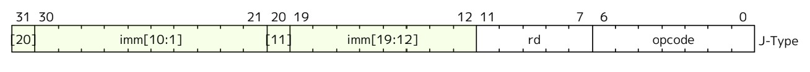

# VSD-Squadron-Internship
A Github repo to keep the progress of my learnings and to complete various tasks assigned to me in the VSD Squadron internship using the VSDSquadron Mini board under Kunal Ghosh sir.

<details>
  <summary>Task 1</summary>
  <br>
    1. Create a GitHub repo.<br>
    2. Install the RISC-V toolchain using VDI.<br>
    3. Refer to the videos, perform the instructions, and play around. 
  <br>

  <br>

  ### Commands for GCC (O0):

  <br>
      1. To check if home directory:
  <br>
    
    cd

  <br>
    2. To open a new C file in leafpad:

  <br>

    leafpad sum1ton.c &
  
  <br>
    3. To compile the code using GCC.

  <br>

    gcc sum1ton.c
  
  <br>
    4. To run the file.

  <br>

    ./a.out
  
  <br>

  

  <br> 
  
  <br>
  
  ### Commands for RISCV (O1):

  <br>
    1. To create an object file from the C file based on the RISC-V character set (O1).
    
  <br>
    
    riscv64-unknown-elf-gcc -O1 -mabi=lp64 -march=rv64i -o sum1ton.o sum1ton.c

  <br>

  

  <br>

  <br>
    2. To create an object file from the C file based on the RISC-V character set (Ofast).
    
  <br>
    
    riscv64-unknown-elf-gcc -Ofast -mabi=lp64 -march=rv64i -o sum1ton.o sum1ton.c

  <br>

  

  <br>

  <br>
    3. To view the object file.
    
  <br>
    
    riscv64-unknown-elf-objdump -d sum1ton.o

  <br>
    4. To view specific lines from the object file.
    
  <br>
    
    riscv64-unknown-elf-objdump -d sum1ton.o | less

  <br>
  
</details>

<details>
<summary>Task 2</summary>
  
  <br>
    1. Run SPIKE simulation and observation with -O1 and -Ofast.<br>
    2. Write a simple C application and compile it with RISC-V gcc / SPIKE.<br>
    
  <br>

  ### Commands to compile using RISCV:

  <br>
    1. To run the SPIKE simulation.

  <br>

      spike pk sum1ton.o

  <br>

  

  <br>

  <br>
    2. To debug sections of object code.

  <br>

    spike -d pk sum1ton.o

  <br>
    3. To run the Program Counter until we want to run the programs manually.

  <br>
  
    : until pc 0 100b0

  <br>

  <br>

  

  <br>

  <br>

  

  <br>

  <br>
    4. To find the contents of a register.

  <br>

    : reg 0 a0

  <br>

  <br>

  

  <br>

  <br>
    Press 'Enter' to run the next instructions.

  <br>

  <br>

  

  <br>

  <br>
    lui - Load Upper Immediate [31:12]

  <br>

  <br>
  
  

  <br>

  <br>
    addi - Add Immediate, -16 in dec which is 10 in hexa, basically 10 sub from the stack pointer.
    
  <br>

  <br>

  ### Binary to Decimal Conversion C Application

  <br>
    Source Code:
    
  <br>

  <br>

  

  <br>

  <br>

  ### Compiling using GCC and Executing.

  <br>

  <br>

  

  <br>

  <br>

  ### Compiling and executing using RISC V.

  <br>
  
  #### SPIKE Simulation:

  <br>
    Using -O1 Execution.

  <br>

    riscv64-unknown-elf-gcc -O1 -mabi=lp64 -march=rv64i -o bintodec.o bintodec.c

  <br>

  <br>

  

  <br>

  <br>

  <br>
    Using -Ofast Execution.

  <br>
    
    riscv64-unknown-elf-gcc -Ofast -mabi=lp64 -march=rv64i -o bintodec.o bintodec.c

  <br>

  <br>

  

  <br>

  <br>
  
</details>

<details>
<summary>Task 3</summary>
  
  ### RISC V Instruction Types:

  #### 1. R - Type Instructions 

  RISC V defines several arithmetic R-type (Register-register) operations. All operations read the rs1 and rs2 registers as
  source operands and write the result into register rd. The funct7 and funct3 fields select the type of
  operation.

  <br>

  <br>

  

  <br>

  <br>

  #### 2. I - Type Instructions

  RISC V defines I-type (Register-immediate) operations, where an arithmetic or logical operation is performed on a 
  sign extended 12-bit immediate and rs1 register, and places the result in rd. The funct3 field is used to select the type of operation.

  <br>

  <br>

  

  <br>

  <br>

  #### 3. S - Type Instructions

  RISC V is a load-store architecture, where only load and store instructions access memory and
  arithmetic instructions only operate on CPU registers. It provides a 32-bit address space that is
  byte-addressed. Load and store instructions transfer a value between the registers and memory. Loads are encoded in
  the I-type format and stores are S-type. The effective address is obtained by adding register rs1 to the
  sign-extended 12-bit offset. Loads copy a value from memory to register rd. Stores copy the value in
  register rs2 to memory.

  <br>

  <br>

  

  <br>

  <br>

  #### 4. B - Type Instructions

  All branch instructions use the B-type instruction format. The 12-bit B-immediate encodes signed offsets in multiples of 2 bytes.
  The offset is sign-extended and added to the branch instruction's address to give the target address. The conditional branch range is 
  ±4 KiB. Branch instructions compare two registers.

  <br>

  <br>

  

  <br>

  <br>

  #### 5. U - Type Instructions

  LUI (load upper immediate) is used to build 32-bit constants and uses the U-type format. LUI places the 32-bit U-immediate value into the 
  destination register rd, filling in the lowest 12 bits with zeros.AUIPC (add upper immediate to pc) is used to build pc-relative addresses and 
  uses the U-type format. AUIPC forms a 32-bit offset from the U-immediate, filling in the lowest 12 bits with zeros, adding this offset to the address 
  of the AUIPC instruction, and then placing the   result in register rd.

  <br>

  <br>

  

  <br>

  <br>

  #### 6. J - Type Instructions

  The jump and link (JAL) instruction uses the J-type format, where the J-immediate encodes a signed offset in multiples of 2 bytes. The offset 
  is sign-extended and added to the address of the jump instruction to form the jump target address. Jumps can therefore target a ±1 MiB range. JAL stores 
  the instruction address following the jump ('pc'+4) into register rd. The standard software calling convention uses 'x1' as the return address register 
  and 'x5' as an alternate link register.

  <br>

  <br>

  

  <br>

  <br>

  ### Instructions and their 32-bit pattern:

  1. auipc t0, 0x0

  ```
  imm [31:12]            rd       opcode
  00000000000000000000   00000    0010111

  ```
  

  2. addi a1, t0, 32

  ```
  imm[11:0]      rs1    addi  rd     opcode
  000000100000   00000  000   00001  0010011
  ```

  3. li ra, 0

  ```
  imm[11:0]      rs1    addi  rd     opcode
  000000000000   00000  000   00001  0000011
  ```

  4. li sp, 0

  ```
  imm[11:0]      rs1    addi  rd     opcode
  000000000000   00000  000   01111  0000011
  ```

  5. li gp, 0

  ```
  imm[11:0]      rs1    addi  rd     opcode
  000000000000   00000  000   10001  0000011
  ```

  6. li tp, 0

  ```
  imm[11:0]      rs1    addi  rd     opcode
  000000000000   00000  000   11001  0000011
  ```

  7. li t0, 0

  ```
  imm[11:0]      rs1    addi  rd     opcode
  000000000000   00000  000   00000  0000011
  ```

  8. li t1, 0

  ```
  imm[11:0]      rs1    addi  rd     opcode
  000000000000   00000  000   00001  0000011
  ```

  9. li t2, 0

  ```
  imm[11:0]      rs1    addi  rd     opcode
  000000000000   00000  000   00010  0000011
  ```

  10. li s0, 0

  ```
  imm[11:0]      rs1    addi  rd     opcode
  000000000000   00000  000   00000  0000011
  ```

  11. li s1, 0

  ```
  imm[11:0]      rs1    addi  rd     opcode
  000000000000   00000  000   00001  0000011
  ```

  12. li a2, 0

  ```
  imm[11:0]      rs1    addi  rd     opcode
  000000000000   00000  000   00010  0000011
  ```

  13. li a3, 0

  ```
  imm[11:0]      rs1    addi  rd     opcode
  000000000000   00000  000   00011  0000011
  ```

  14. li a4, 0

  ```
  imm[11:0]      rs1    addi  rd     opcode
  000000000000   00000  000   00100  0000011
  ```

  15. li a5, 0

  ```
  imm[11:0]      rs1    addi  rd     opcode
  000000000000   00000  000   00101  0000011
  ```

</details>
