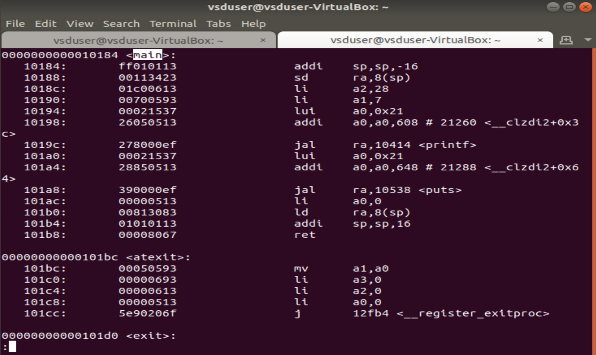

# VSD-Squadron-Internship
A Github repo to keep the progress of my learnings and to complete various tasks assigned to me in the VSD Squadron internship using the VSDSquadron Mini board under Kunal Ghosh sir.

  
Task 1

   
    1. Create a GitHub repo. 
    2. Install the RISC-V toolchain using VDI. 
    3. Refer to the videos, perform the instructions, and play around. 
   

   

  ### Commands for GCC (O0):

   
      1. To check if home directory:
   
    
    cd

   
    2. To open a new C file in leafpad:

   

    leafpad sum1ton.c &
  
   
    3. To compile the code using GCC.

   

    gcc sum1ton.c
  
   
    4. To run the file.

   

    ./a.out
  
   

  

    
  
   
  
  ### Commands for RISCV (O1):

   
    1. To create an object file from the C file based on the RISC-V character set (O1).
    
   
    
    riscv64-unknown-elf-gcc -O1 -mabi=lp64 -march=rv64i -o sum1ton.o sum1ton.c

   

  

   

   
    2. To create an object file from the C file based on the RISC-V character set (Ofast).
    
   
    
    riscv64-unknown-elf-gcc -Ofast -mabi=lp64 -march=rv64i -o sum1ton.o sum1ton.c

   

  

   

   
    3. To view the object file.
    
   
    
    riscv64-unknown-elf-objdump -d sum1ton.o

   
    4. To view specific lines from the object file.
    
   
    
    riscv64-unknown-elf-objdump -d sum1ton.o | less

   
  

