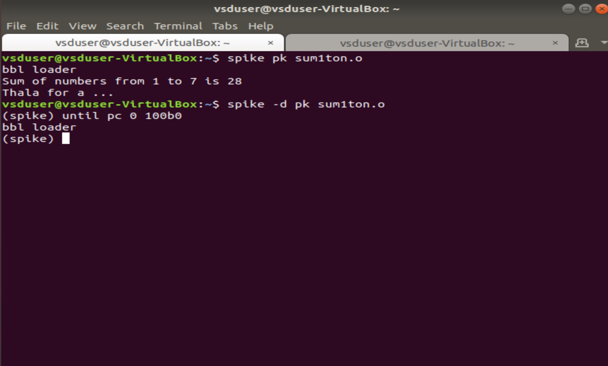
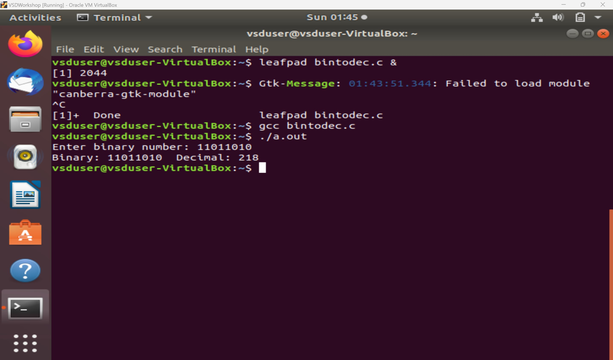

# VSD-Squadron-Internship
A Github repo to keep the progress of my learnings and to complete various tasks assigned to me in the VSD Squadron internship using the VSDSquadron Mini board under Kunal Ghosh sir.

  
Task 1

   
    1. Create a GitHub repo. 
    2. Install the RISC-V toolchain using VDI. 
    3. Refer to the videos, perform the instructions, and play around. 
   

   

  ### Commands for GCC (O0):

   
      1. To check if home directory:
   
    
    cd

   
    2. To open a new C file in leafpad:

   

    leafpad sum1ton.c &
  
   
    3. To compile the code using GCC.

   

    gcc sum1ton.c
  
   
    4. To run the file.

   

    ./a.out
  
   

  

    
  
   
  
  ### Commands for RISCV (O1):

   
    1. To create an object file from the C file based on the RISC-V character set (O1).
    
   
    
    riscv64-unknown-elf-gcc -O1 -mabi=lp64 -march=rv64i -o sum1ton.o sum1ton.c

   

  

   

   
    2. To create an object file from the C file based on the RISC-V character set (Ofast).
    
   
    
    riscv64-unknown-elf-gcc -Ofast -mabi=lp64 -march=rv64i -o sum1ton.o sum1ton.c

   

  

   

   
    3. To view the object file.
    
   
    
    riscv64-unknown-elf-objdump -d sum1ton.o

   
    4. To view specific lines from the object file.
    
   
    
    riscv64-unknown-elf-objdump -d sum1ton.o | less

   
  

Task 2

  
   
    1. Run SPIKE simulation and observation with -O1 and -Ofast. 
    2. Write a simple C application and compile it with RISC-V gcc / SPIKE. 
    
   

  ### Commands to compile using RISCV:

   
    1. To run the SPIKE simulation.

   

      spike pk sum1ton.o

   

  

   

   
    2. To debug sections of object code.

   

    spike -d pk sum1ton.o

   
    3. To run the Program Counter until we want to run the programs manually.

   
  
    : until pc 0 100b0

   

   

  

   

   

  

   

   
    4. To find the contents of a register.

   

    : reg 0 a0

   

   

  

   

   
    Press 'Enter' to run the next instructions.

   

   

  

   

   
    lui - Load Upper Immediate [31:12]

   

   
  
  

   

   
    addi - Add Immediate, -16 in dec which is 10 in hexa, basically 10 sub from the stack pointer.
    
   

   

  ### Binary to Decimal Conversion C Application

   
    Source Code:
    
   

   

  

   

   

  ### Compiling using GCC and Executing.

   

   

  

   

   

  ### Compiling and executing using RISC V.

   
  
  #### SPIKE Simulation:

   
    Using -O1 Execution.

   

    riscv64-unknown-elf-gcc -O1 -mabi=lp64 -march=rv64i -o bintodec.o bintodec.c

   

   

  

   

   

   
    Using -Ofast Execution.

   
    
    riscv64-unknown-elf-gcc -Ofast -mabi=lp64 -march=rv64i -o bintodec.o bintodec.c

   

   

  

   

   
  

